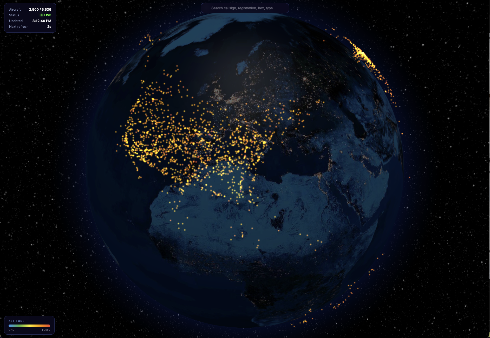

# SkyPulse

Real-time global flight tracker on an interactive 3D globe. Watch thousands of aircraft move across the planet, live in your browser.

**[Live Demo](https://npow.github.io/skypulse/)**

  



## Features

- **3D Globe** — Night Earth texture, starfield, atmosphere glow, smooth auto-rotation
- **Live Aircraft** — ~6,000+ planes worldwide, updated every 5 seconds
- **Altitude Coloring** — Blue (ground) → green → yellow → orange → red (FL450)
- **Hover Tooltips** — Callsign, altitude, and ground speed at a glance
- **Detail Panel** — Click any aircraft for full info: registration, type, position, speed, heading, vertical rate, Mach, squawk, emergency status, military flag
- **Search** — Find aircraft by callsign, registration, ICAO hex, or type code
- **Zero Setup** — Single HTML file, no build step, no API keys, no server

## Quick Start

Open `index.html` in any modern browser. That's it.

```sh
# or serve it locally
npx serve .
```

## Data Source

All flight data comes from [adsb.lol](https://api.adsb.lol/docs), a free community-driven ADS-B aggregator. No authentication or API keys required.

## Tech Stack

| Layer | Technology |
|-------|-----------|
| Globe | [Globe.gl](https://globe.gl/) (Three.js) via CDN |
| Data | [adsb.lol API](https://api.adsb.lol/docs) |
| App | Single `index.html`, vanilla JS + CSS |

## License

MIT
